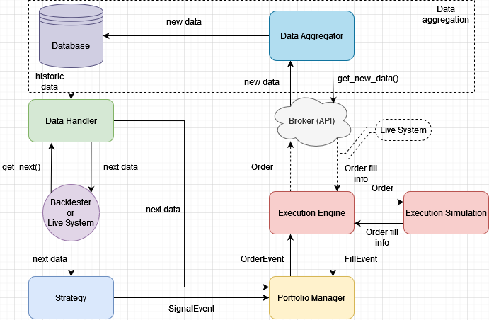
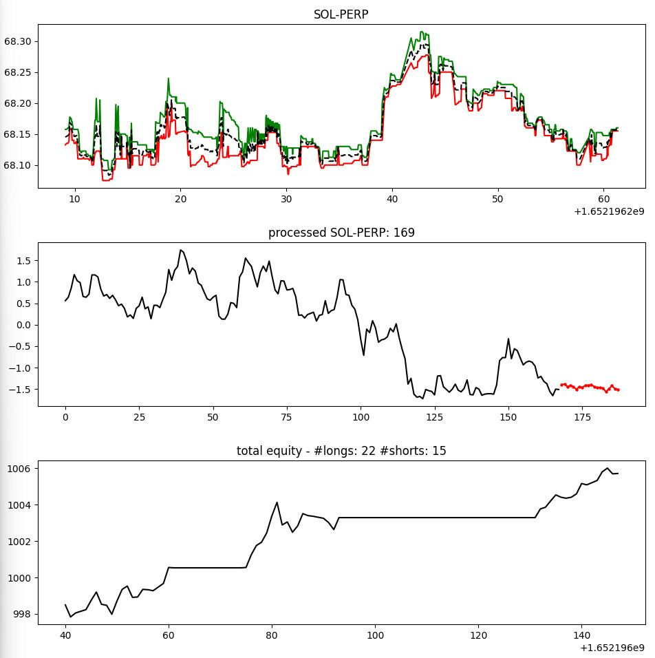

# SCINet
TensorFlow SCINet implementation with extensions for Advances in Deep Learning Leiden University 2022

## -------------------------------------------------------------------------------

This repository contains a TensorFlow implementation of the SCINet model as described in https://arxiv.org/abs/2106.09305, adapted from https://github.com/cure-lab/SCINet. 

The repository is divided into two main folders: `base/` and `exp/`:
- `base/`: contains the core implementation of the SCINet model (and builder), the data preprocessing scripts and the training scripts. All experiments must use this base implementation.

- `exp/`: contains several experiments that contain Jupyter notebooks that guide the reader through several components of this work: training process and its preprocessing, the result reproduction of the original paper, the backtester, a live trading demo and more. All subfolders contain a more elaborate explanation of the experiments.

## SCINet Training

## Results Reproduction

## Hyperparameter optimization

## Solar Dataset 

## Backtester
The backtester is a system to assess SCINet's performance on a historic dataset in an event-driven manner. This is done by loading the historic data and replaying it as if it were live and repeatedly prompting the strategy for actions (buy, sell, do nothing, etc.).

A strategy is an implementation that takes the dataset as input and outputs actions. In this notebook, we will consider a simple strategy based on the output of the SCINet model. The exact strategy is explained in detail in the `backtester` subfolder.

The figure below shows the different individual components that make up the backtesting system. The data aggregation was done by simply downloading the crypto dataset: https://www.kaggle.com/datasets/jordialonsoesteve/cyrpto-data.

## Live Trading Simulation
The live trading system works by subscribing to a brokers (FTX) websocket and processing all changes in the orderbook. This is filtered for the best bid and best ask in order to calculate the mid-price as ``the price''. No slippage or fees are taken into account as the small order assumption holds here (our market orders will have no impact on the price). This price fluctuations are accumulated for a certain period which then forms one data point for the SCINet model (open, high, low, close). These datapoints are accumulated to form a sequence that is the input to the SCINet model. Then, similar to the backtesting system. 

As we are dealing with a highly asynchronous system the different components described above are divided in three separate threads: websocket thread, data preparation thread, scinet model strategy thread. This way, the individual processes run in parallel allowing each of the processes to not be held back by the others.

The dlive demo shows three plots below each other: the best bid and ask (and halfway price) as retrieved from the websocket, the preprocessed data sample + prediction (in red below) and the live total equity from top to bottom respectively. 

## Probabilistic SCINet
